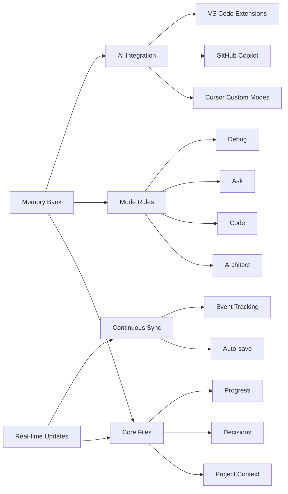
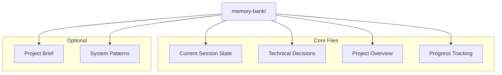
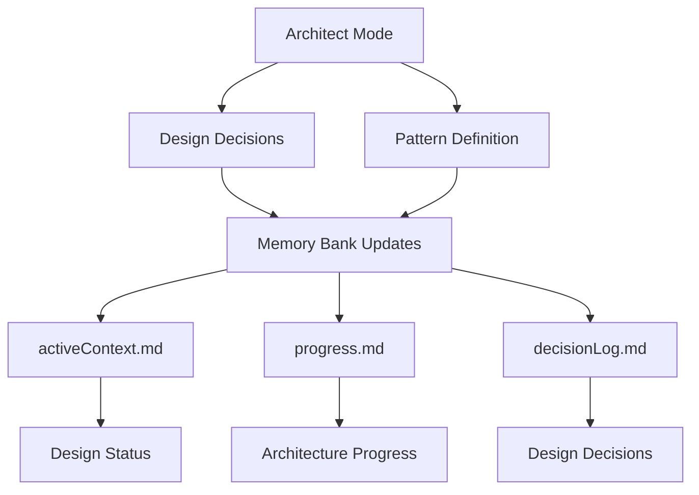
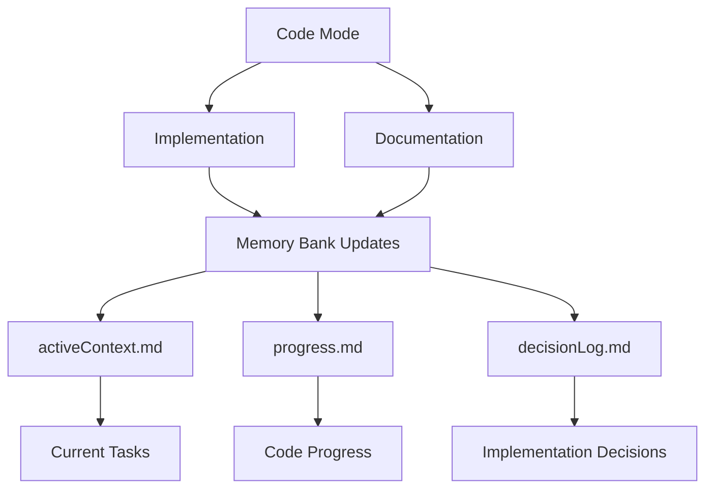
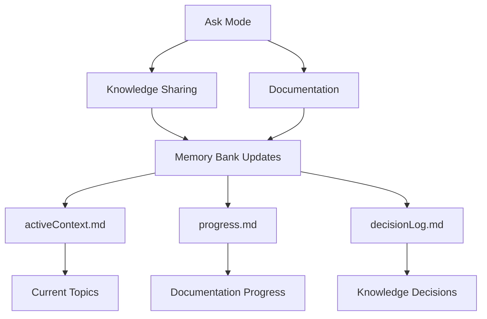
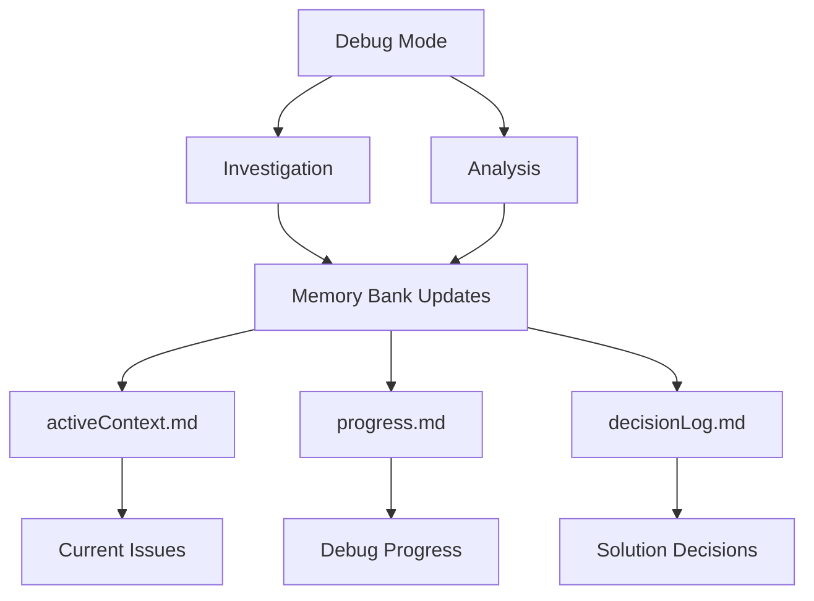

<div align="center">

## 🚀 NEW: Cursor Custom Modes Integration!

Check out the revolutionary **[Cursor Custom Modes Integration](CURSOR-INTEGRATION.md)** - bringing Memory Bank to Cursor's new custom mode feature with specialized AI assistants for different development tasks!

Also check out the new ✨[Context Portal MCP](https://github.com/GreatScottyMac/context-portal)✨

<br>

# 🧠 Memory Bank

**Persistent Project Context for AI-Assisted Development**

[](https://github.com/RooVetGit/Roo-Code)
[](https://github.com/features/copilot)
[](https://github.com/GreatScottyMac/roo-code-memory-bank)

</div>

## 🎯 Overview

Memory Bank solves a critical challenge in AI-assisted development: **maintaining context across sessions**. By providing a structured memory system that integrates with VS Code, Cursor, and GitHub Copilot, it ensures your AI assistant maintains a deep understanding of your project across sessions and memory resets.

### Key Components



- 🧠 **Memory Bank**: Persistent storage for project knowledge
- 📋 **Mode Rules**: YAML-based behavior configuration
- 🔧 **Multi-IDE Integration**: Cursor, VS Code, GitHub Copilot support
- ⚡ **Real-time Updates**: Continuous context synchronization

## 🚀 Quick Start

### Universal Setup (Recommended) ✨

**New to Memory Bank?** Start with our interactive setup:

```bash
git clone https://github.com/GreatScottyMac/roo-code-memory-bank.git
cd roo-code-memory-bank  
./scripts/setup-memory-bank.sh
```

Choose from:
- 🏗️ **Cursor Custom Modes** - Specialized AI assistants
- 🤖 **GitHub Copilot Integration** - Enhanced VS Code experience
- 🏄 **Windsurf Integration** - Cascade AI with persistent context
- 🚀 **All Integrations** - Complete Memory Bank experience

### For Cursor Users: Custom Modes Integration! 🎉

**Want the ultimate AI development experience?** Try our **[Cursor Custom Modes Integration](CURSOR-INTEGRATION.md)**:

```bash
git clone https://github.com/GreatScottyMac/roo-code-memory-bank.git
cd roo-code-memory-bank  
./scripts/setup-cursor-memory-bank.sh
```

Get specialized AI assistants with keyboard shortcuts:
- 🏗️ Architect (`⌘⇧A`) - System design & initialization
- 💻 Code (`⌘⇧C`) - Implementation with full context  
- ❓ Ask (`⌘⇧?`) - Information & guidance
- 🐛 Debug (`⌘⇧D`) - Context-aware troubleshooting
- 🔄 Update (`⌘⇧U`) - Session synchronization

### For GitHub Copilot Users: Enhanced Context! ✨

**Already using GitHub Copilot?** Enhance it with Memory Bank context:

```bash
git clone https://github.com/GreatScottyMac/roo-code-memory-bank.git
cd your-project
../roo-code-memory-bank/scripts/setup-github-copilot.sh
```

Get enhanced AI development with:
- 📝 **Repository Custom Instructions** - Project context for Copilot
- ⚙️ **VS Code Workspace Settings** - Enhanced code generation
- 📁 **Sample Prompt Templates** - Reusable patterns
- 🔄 **Commit Message Integration** - Context-aware commits

[Learn more about GitHub Copilot integration →](GITHUB-COPILOT-INTEGRATION.md)

### For Windsurf Users: Cascade AI Integration! 🏄

**Want agentic AI development?** Try our **[Windsurf Integration](WINDSURF-INTEGRATION.md)**:

```bash
git clone https://github.com/GreatScottyMac/roo-code-memory-bank.git
cd your-project
../roo-code-memory-bank/scripts/setup-windsurf.sh
```

Get enhanced development with:
- 📝 **Windsurf Rules** - Custom behavior for Cascade AI
- 🧠 **Persistent Context** - Project memory across sessions
- 🔄 **Automatic Updates** - Real-time Memory Bank maintenance
- 🎯 **Trigger Commands** - Easy Memory Bank operations

[Learn more about Windsurf integration →](WINDSURF-INTEGRATION.md)

### Original VS Code Integration

### 1. Mode-specific Custom Instructions

1. Open the extension prompts settings.
2. Select the mode to modify.
3. Copy/Paste the contents of the corresponding [memory_bank_strategy_"mode".yml](https://github.com/GreatScottyMac/roo-code-memory-bank/tree/main/modules) file.
4. Save the changes. 

### 2. Initialize Memory Bank

1. Switch to **Architect** or **Code** mode in your AI chat
2. Send a message (e.g., "hello")
3. The AI will automatically:
   - 🔍 Scan for `memory-bank/` directory
   - 📁 Create it if missing (with your approval)
   - 📝 Initialize core files
   - 🚦 Provide next steps

<details>
<summary>💡 Pro Tip: Project Brief</summary>

Create a `projectBrief.md` in your project root **before** initialization to give your AI immediate project context.
</details>

### File Organization

```
project-root/
├── memory-bank/
│   ├── activeContext.md
│   ├── productContext.md
│   ├── progress.md
│   └── decisionLog.md  
└── projectBrief.md
```

## 📚 Memory Bank Structure



<details>
<summary>📖 View File Descriptions</summary>

| File | Purpose |
|------|----------|
| `activeContext.md` | Tracks current goals, decisions, and session state |
| `decisionLog.md` | Records architectural choices and their rationale |
| `productContext.md` | Maintains high-level project context and knowledge |
| `progress.md` | Documents completed work and upcoming tasks |
| `projectBrief.md` | Contains initial project requirements (optional) |
| `systemPatterns.md` | Documents recurring patterns and standards |

</details>

## ✨ Features

### 🧠 Persistent Context
- Remembers project details across sessions
- Maintains consistent understanding of your codebase
- Tracks decisions and their rationale

### 📊 Knowledge Management
- Structured documentation with clear purposes
- Technical decision tracking with rationale
- Automated progress monitoring
- Cross-referenced project knowledge

## 💡 Pro Tips

### Architect Mode
Roo Code Memory Bank's Architect mode is designed for high-level system design and project organization. This mode focuses on architectural decisions, system structure, and maintaining project-wide consistency.

#### Key Capabilities
- 🏗️ **System Design**: Create and maintain architecture
- 📐 **Pattern Definition**: Establish coding patterns and standards
- 🔄 **Project Structure**: Organize code and resources
- 📋 **Documentation**: Maintain technical documentation
- 🤝 **Team Collaboration**: Guide implementation standards

#### Real-time Update Triggers
Architect mode actively monitors and updates Memory Bank files based on:
- 🎯 Architectural decisions and changes
- 📊 System pattern definitions
- 🔄 Project structure updates
- 📝 Documentation requirements
- ⚡ Implementation guidance needs

#### Memory Bank Integration


Switch to Architect mode when you need to:
- Design system architecture
- Define coding patterns
- Structure new projects
- Guide implementations
- Make architectural decisions

### Code Mode
Roo Code Memory Bank's Code mode is your primary interface for implementation and development. This mode specializes in writing, modifying, and maintaining code while following established patterns.

#### Key Capabilities
- 💻 **Code Creation**: Write new code and features
- 🔧 **Code Modification**: Update existing implementations
- 📚 **Documentation**: Add code comments and docs
- ✨ **Quality Control**: Maintain code standards
- 🔄 **Refactoring**: Improve code structure

#### Real-time Update Triggers
Code mode actively monitors and updates Memory Bank files based on:
- 📝 Code implementations
- 🔄 Feature updates
- 🎯 Pattern applications
- ⚡ Performance improvements
- 📚 Documentation updates

#### Memory Bank Integration


Switch to Code mode when you need to:
- Implement new features
- Modify existing code
- Add documentation
- Apply coding patterns
- Refactor code

### Ask Mode
Roo Code Memory Bank's Ask mode serves as your knowledge base interface and documentation assistant. This mode excels at providing information, explaining concepts, and maintaining project knowledge.

#### Key Capabilities
- 💡 **Knowledge Sharing**: Access project insights
- 📚 **Documentation**: Create and update docs
- 🔍 **Code Explanation**: Clarify implementations
- 🤝 **Collaboration**: Share understanding
- 📖 **Pattern Education**: Explain system patterns

#### Real-time Update Triggers
Ask mode actively monitors and updates Memory Bank files based on:
- ❓ Knowledge requests
- 📝 Documentation needs
- 🔄 Pattern explanations
- 💡 Implementation insights
- 📚 Learning outcomes

#### Memory Bank Integration


Switch to Ask mode when you need to:
- Understand code patterns
- Get implementation guidance
- Create documentation
- Share knowledge
- Learn system concepts

### Debug Mode
Roo Code Memory Bank's Debug mode specializes in systematic problem-solving and troubleshooting. This mode employs strategic analysis and verification to identify and resolve issues.

#### Key Capabilities
- 🔍 **Issue Investigation**: Analyze problems systematically
- 📊 **Error Analysis**: Track error patterns
- 🎯 **Root Cause Finding**: Identify core issues
- ✅ **Solution Verification**: Validate fixes
- 📝 **Problem Documentation**: Record findings

#### Real-time Update Triggers
Debug mode actively monitors and updates Memory Bank files based on:
- 🐛 Bug discoveries
- 📈 Performance issues
- 🔄 Error patterns
- ⚡ System bottlenecks
- 📝 Fix verifications

#### Memory Bank Integration


Switch to Debug mode when you need to:
- Investigate issues
- Analyze errors
- Find root causes
- Verify fixes
- Document problems

### Session Management
- ⚡ **Real-time Updates**: Memory Bank automatically stays synchronized with your work
- 💾 **Manual Updates**: Use "UMB" or "update memory bank" as a fallback when:
  - Ending a session unexpectedly
  - Halting mid-task
  - Recovering from connection issues
  - Forcing a full synchronization

## 📖 Documentation

- [Developer Deep Dive](https://github.com/GreatScottyMac/roo-code-memory-bank/blob/main/developer-primer.md)
- [Update Log](https://github.com/GreatScottyMac/roo-code-memory-bank/blob/main/updates.md)

---

<div align="center">

**[View on GitHub](https://github.com/GreatScottyMac/roo-code-memory-bank) • [Report Issues](https://github.com/GreatScottyMac/roo-code-memory-bank/issues) • [Get Roo Code](https://github.com/RooVetGit/Roo-Code)**

</div>

## License

Apache 2.0 © 2025 [GreatScottyMac](LICENSE)

## 🤝 GitHub Copilot Integration

Memory Bank seamlessly integrates with GitHub Copilot to provide enhanced context and better code generation. Here's how to set it up:

### 1. Repository Custom Instructions

Create a `.github/copilot-instructions.md` file in your project root:

```bash
# Add to your .github/copilot-instructions.md
echo "
# Memory Bank Integration

This project uses Memory Bank for persistent context across AI sessions.

## Context Files
- Read memory-bank/activeContext.md for current session goals and status
- Check memory-bank/productContext.md for project overview and architecture
- Review memory-bank/decisionLog.md for architectural decisions and rationale
- Consult memory-bank/progress.md for completed work and next steps

## Coding Standards
- Follow patterns documented in memory-bank/systemPatterns.md
- Reference established conventions in productContext.md
- Maintain consistency with existing architectural decisions

## Memory Bank Updates
- When making significant changes, suggest updates to relevant memory bank files
- Include rationale for architectural decisions in decisionLog.md
- Track progress and completed work in progress.md
" >> .github/copilot-instructions.md
```

### 2. Workspace Configuration

Add Memory Bank settings to your VS Code workspace settings:

```json
{
  "github.copilot.chat.codeGeneration.instructions": [
    {
      "file": "./memory-bank/productContext.md"
    },
    {
      "file": "./memory-bank/systemPatterns.md"
    }
  ],
  "github.copilot.chat.commitMessageGeneration.instructions": [
    {
      "text": "Reference memory-bank/progress.md for context. Include relevant task IDs and feature descriptions."
    }
  ]
}
```

### 3. Enhanced Workflows

With Memory Bank + GitHub Copilot, you get:

- **Context-Aware Code Generation**: Copilot understands your project's patterns and decisions
- **Consistent Architecture**: References established patterns from systemPatterns.md
- **Informed Commit Messages**: Leverages progress tracking for meaningful commits
- **Decision Continuity**: Maintains architectural consistency across sessions

### 4. Best Practices

1. **Initialize Memory Bank First**: Set up your memory bank structure before configuring Copilot
2. **Keep Instructions Updated**: Regular sync between memory bank files and custom instructions
3. **Reference in Prompts**: Explicitly mention memory bank files in your Copilot prompts
4. **Collaborative Context**: Share memory bank patterns across your team

Example Copilot prompt:
```
Generate a new API endpoint following the patterns in memory-bank/systemPatterns.md 
and considering the architecture decisions in memory-bank/decisionLog.md
```
